# 🛒 AgentCart

### AI-Powered Agentic Commerce Platform

> **Discover. Negotiate. Buy Smarter.**

[](https://www.oracle.com/java/)
[](https://spring.io/projects/spring-boot)
[](https://spring.io/projects/spring-security)
[](https://www.mysql.com/)
[](https://razorpay.com/)
[](https://developer.mozilla.org/en-US/docs/Web/JavaScript)
[](#license)

---

## 📌 Overview

**AgentCart** is an AI-ready commerce platform designed around the concept of **Agentic Commerce**.

The platform combines:

- 🛍️ E-commerce
- 🤖 AI agent workflows
- 🤝 Product negotiation
- 🔐 Secure authentication
- 👥 Role-based authorization
- 🛒 Cart and order management
- ✅ Transaction approvals
- 💳 Razorpay payments
- 📜 Explainable and auditable commerce
- 📈 Merchant growth intelligence

The long-term goal is to enable an **AI buyer or shopping agent** to discover products, compare options, negotiate prices, operate within spending limits, request approval when required, and complete secure transactions.

---

# 🎯 Problem Statement

## AI Growth & Agentic Commerce

Traditional e-commerce platforms are primarily designed for humans.

With the growth of AI agents, commerce is moving toward a model where an AI system can actively participate in:

- Product discovery
- Product comparison
- Price negotiation
- Purchase recommendations
- Upselling
- Cross-selling
- Checkout
- Payment orchestration

The challenge is to make merchants:

> **Discoverable, negotiable and transactable by AI buyers.**

At the same time, financial actions performed or assisted by AI must remain:

- **Explainable**
- **Bounded**
- **Gated**
- **Auditable**
- **Recoverable**

AgentCart is being developed as a platform for this model of commerce.

---

# 💡 Core Idea

Instead of:

```text
Human
  ↓
Website
  ↓
Product
  ↓
Checkout
  ↓
Payment
```

AgentCart is designed to evolve toward:

```text
User / AI Buyer
       ↓
   AI Agent
       ↓
Discover Products
       ↓
Compare Products
       ↓
Recommend
       ↓
Negotiate
       ↓
Spending Policy
       ↓
User Approval
       ↓
Create Order
       ↓
Razorpay
       ↓
Payment Verification
       ↓
Audit Trail
       ↓
Order Completed
```

---

# 🚀 Project Vision

The vision of AgentCart is to build a commerce platform where an AI agent can assist with or perform commerce actions while remaining within clearly defined boundaries.

### Long-term architecture

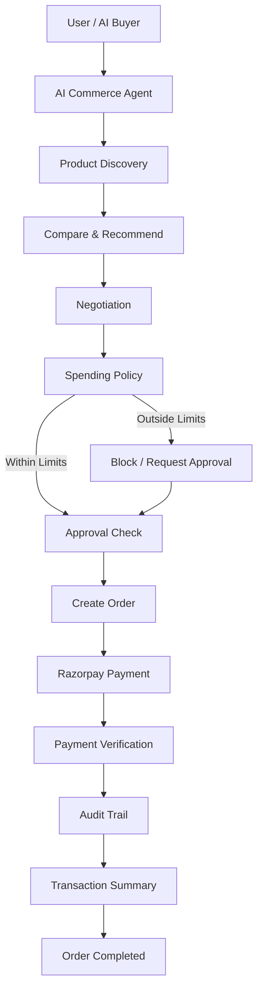

---

# ✨ Current Features

## 🔐 Authentication & Authorization

Implemented:

- User registration
- User login
- JWT authentication
- BCrypt password hashing
- Stateless authentication
- Role-based authorization
- USER role
- ADMIN role
- Protected REST APIs
- Custom access-denied handling
- JWT request filtering

### Authentication Flow

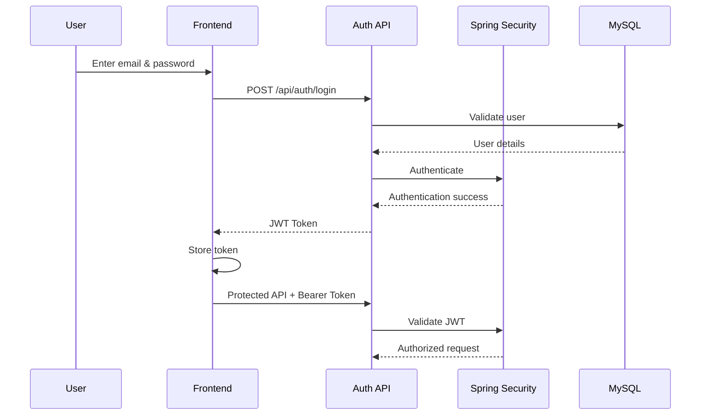

---

# 👤 User Management

The platform provides user-focused functionality including:

- Registration
- Login
- Profile access
- Authenticated user identification
- Role management
- User-specific resources

---

# 📦 Product Management

AgentCart provides an admin-controlled product catalog.

### Customer capabilities

Customers can:

- Browse products
- View product details
- Discover products
- Start negotiations
- Add products to cart
- Continue toward checkout

### Admin capabilities

Admins can:

- Add products
- Update products
- Delete products
- Manage the product catalog

### Product APIs

```http
GET     /products
GET     /products/{id}

POST    /products
PUT     /products/{id}
DELETE  /products/{id}
```

Product modification APIs are restricted to administrators.

---

# 🤝 Negotiation System

AgentCart includes a negotiation workflow that forms the foundation for AI-assisted commerce.

### Negotiation concept

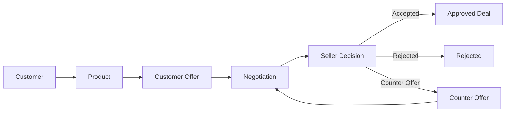

The long-term objective is to allow an AI commerce agent to negotiate within merchant-defined limits.

---

# 🛒 Cart & Commerce

AgentCart provides a commerce journey around:

```text
Product Discovery
       ↓
Product Details
       ↓
Add to Cart
       ↓
Cart
       ↓
Checkout
       ↓
Order
```

The frontend is built using standard web technologies and is served directly from the Spring Boot application.

---

# 📋 Order Management

The order system is designed to connect:

```text
Customer
   ↓
Cart
   ↓
Order
   ↓
Approval
   ↓
Payment
```

The backend maintains customer-specific order information and order totals.

---

# ✅ Approval-Based Transactions

One of the important design principles of AgentCart is that a financial action should not automatically become a payment without appropriate authorization.

Instead:

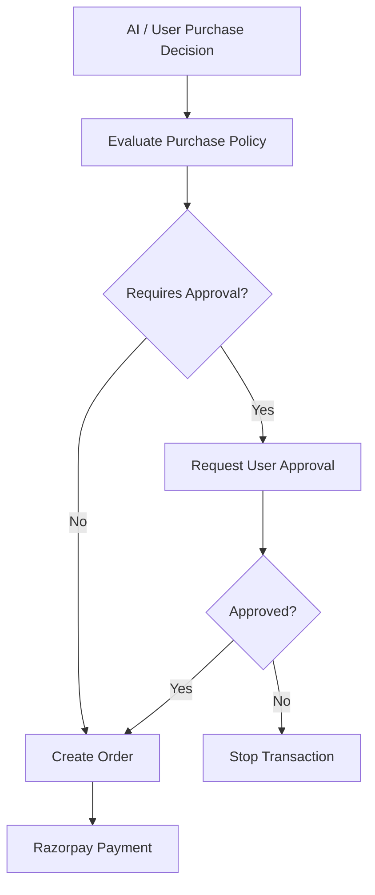

This architecture becomes especially important when AI agents are allowed to make purchase decisions.

---

# 💳 Razorpay Integration

AgentCart integrates with **Razorpay Test Mode**.

The payment architecture is designed around secure server-side payment orchestration.

### Payment Flow

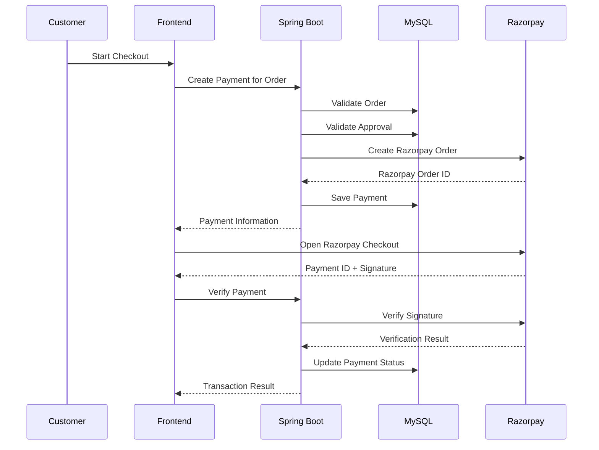

### Payment APIs

```http
POST /api/payments/order/{orderId}

GET  /api/payments/{id}

GET  /api/payments
```

### Payment Safety

The backend validates:

- Order existence
- Customer ownership
- Approval status
- Duplicate payment prevention
- Razorpay order creation
- Payment state
- Payment verification

---

# 🔒 Security Architecture

AgentCart uses Spring Security and JWT.

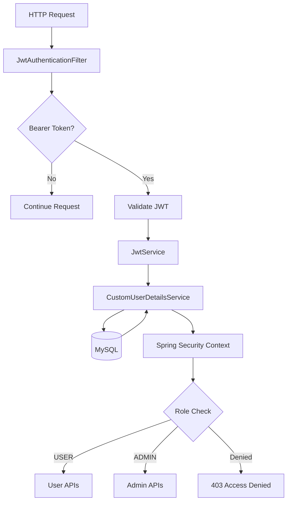

### Security Features

- JWT-based authentication
- BCrypt password hashing
- Stateless sessions
- Role-based authorization
- Protected APIs
- Admin-only product operations
- Customer-specific resource validation
- Payment ownership validation
- Approval validation
- Custom access-denied handling

---

# 🧠 Agentic Commerce

AgentCart is being developed beyond a traditional e-commerce application.

The AI layer is intended to become an intelligent commerce orchestration layer.

---

## 🤖 AI Shopping Agent

A future AI shopping agent will understand natural-language requests such as:

> "Find me a laptop under ₹70,000 for Java development."

The agent can reason over:

- Budget
- Category
- Product attributes
- Availability
- Seller
- Negotiability
- User preferences

### Agent workflow

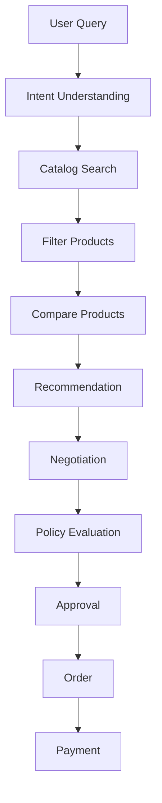

---

# 🧾 Agent-Readable Product Catalog

A major part of the AI-native architecture is a machine-readable catalog.

Example:

```json
{
  "productId": 101,
  "name": "Developer Laptop",
  "category": "Laptop",
  "price": 65000,
  "currency": "INR",
  "availability": true,
  "negotiable": true
}
```

An AI agent can consume structured information such as:

- Product identity
- Price
- Currency
- Availability
- Category
- Attributes
- Negotiability
- Merchant information

---

# 💰 Bounded Spending Policy

AI should never have unlimited purchasing authority.

AgentCart is designed to support policies such as:

```text
Maximum Budget: ₹70,000

Maximum Negotiation Discount: 10%

Auto Purchase Limit: ₹20,000

Approval Required Above: ₹20,000

Allowed Category:
Electronics
```

### Policy architecture

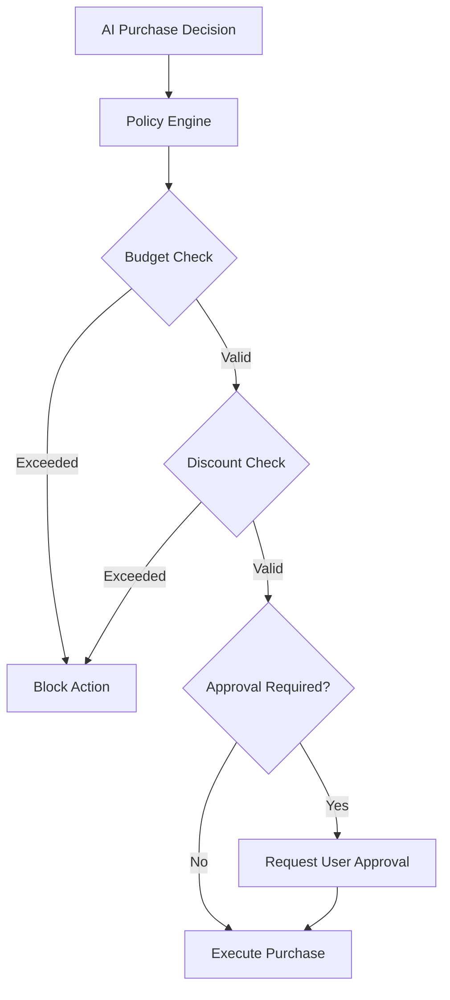

This creates a foundation for **safe autonomous commerce**.

---

# 🧠 Explainable Commerce

An AI agent should not simply say:

> "Buy this product."

It should explain:

```text
Purchase Recommendation

Product:
Developer Laptop

Price:
₹64,999

Why this product?

• Fits the requested budget
• Matches the requested category
• Suitable for programming
• Seller supports negotiation
• Final negotiated price is within policy

Action:

Purchase requires user approval.
```

The goal is to make financial AI decisions understandable to users.

---

# 📜 Commerce Audit Trail

Agentic commerce requires traceability.

A future audit system will record events such as:

```text
10:32:11  User searched products
10:32:18  Agent selected products
10:32:31  Product recommended
10:33:02  Negotiation started
10:33:14  Seller offer received
10:33:20  Spending policy evaluated
10:33:25  Approval requested
10:33:42  User approved
10:33:48  Order created
10:34:01  Razorpay order created
10:34:32  Payment completed
```

Each important action should have:

- Timestamp
- Actor
- Action
- Target
- Reason
- Result
- Transaction reference

---

# 🔄 Graceful Failure Handling

An AI commerce system must fail safely.

### Payment failure

```text
Payment Failed
      ↓
Preserve Transaction State
      ↓
Do Not Duplicate Order
      ↓
Explain Failure
      ↓
Allow Retry
```

### Product unavailable

```text
Product Unavailable
      ↓
Search Similar Products
      ↓
Recommend Alternatives
```

### Negotiation failure

```text
Negotiation Failed
      ↓
Explain Reason
      ↓
Offer Alternative
```

### Payment verification failure

```text
Verification Failed
      ↓
Do Not Mark Payment Successful
      ↓
Preserve Payment State
      ↓
Allow Recovery
```

---

# 📈 AI Upsell & Cross-Sell

AgentCart is designed to support intelligent product recommendations.

Example:

```text
Customer
   ↓
Laptop Purchase
   ↓
AI detects opportunity
   ↓
Recommended:
   ├── Wireless Mouse
   ├── Keyboard
   ├── Laptop Stand
   └── USB Hub
```

Recommendations can consider:

- Current cart
- Product compatibility
- Previous purchases
- User intent
- Budget
- Product relationships

---

# 📣 AI Campaign Orchestrator

A future merchant-side AI agent can help create revenue-growth campaigns.

Example:

```text
Campaign Goal:
Increase weekend revenue

Target:
Electronics customers

Budget:
₹10,000

Duration:
3 days
```

The agent can propose:

- Discounts
- Bundles
- Product promotions
- Upsell opportunities
- Cross-sell opportunities
- Campaign strategies

Financial actions remain bounded by merchant-defined limits.

---

# 📊 Merchant Growth Intelligence

A future merchant dashboard will provide:

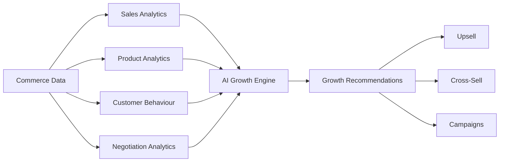

Potential insights include:

- Best-selling products
- Average order value
- Conversion rate
- Negotiation success rate
- Cart abandonment
- Product performance
- Upsell opportunities
- Cross-sell opportunities

---

# 🤝 Agent-to-Agent Commerce

The long-term architecture supports interaction between:

```text
Customer AI Agent
        ↓
   AgentCart
        ↓
Merchant Commerce Agent
        ↓
Product / Price / Availability
        ↓
Negotiation
        ↓
Policy
        ↓
Transaction
```

This represents the transition from:

> **Human → Website**

to:

> **AI Agent → Commerce Platform → Merchant**

---

# 🏗️ System Architecture

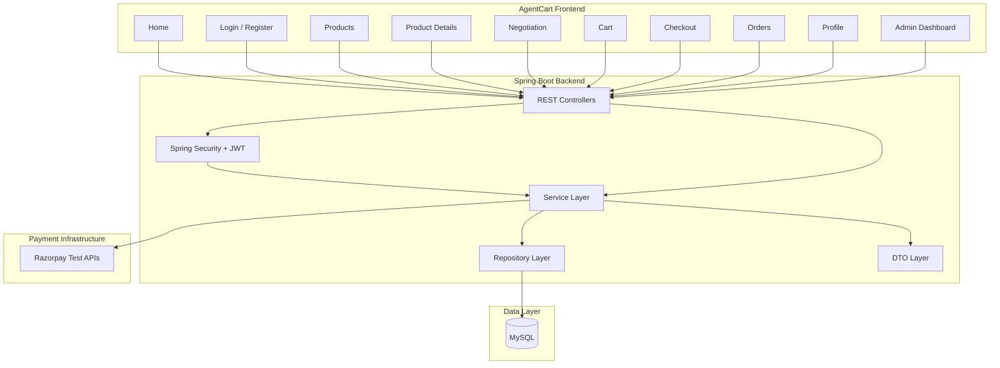

---

# 📁 Project Structure

```text
AgentCart/
│
├── backend/
│   │
│   ├── src/
│   │   └── main/
│   │       │
│   │       ├── java/
│   │       │   └── com/
│   │       │       └── soniya/
│   │       │           │
│   │       │           ├── controller/
│   │       │           │
│   │       │           ├── service/
│   │       │           │
│   │       │           ├── repository/
│   │       │           │
│   │       │           ├── entity/
│   │       │           │
│   │       │           ├── dto/
│   │       │           │
│   │       │           └── security/
│   │       │
│   │       └── resources/
│   │           │
│   │           ├── application.properties
│   │           │
│   │           └── static/
│   │               │
│   │               ├── index.html
│   │               ├── login.html
│   │               ├── register.html
│   │               ├── products.html
│   │               ├── product-details.html
│   │               ├── negotiation.html
│   │               ├── cart.html
│   │               ├── checkout.html
│   │               ├── orders.html
│   │               ├── profile.html
│   │               ├── admin.html
│   │               │
│   │               └── assets/
│   │                   ├── css/
│   │                   │   ├── style.css
│   │                   │   ├── auth.css
│   │                   │   ├── products.css
│   │                   │   ├── dashboard.css
│   │                   │   └── responsive.css
│   │                   │
│   │                   └── js/
│   │                       ├── api.js
│   │                       ├── auth.js
│   │                       ├── common.js
│   │                       ├── products.js
│   │                       ├── negotiation.js
│   │                       ├── cart.js
│   │                       ├── orders.js
│   │                       ├── payment.js
│   │                       └── admin.js
│   │
│   └── pom.xml
│
└── README.md
```

---

# 🧰 Technology Stack

## Backend

| Technology | Purpose |
|---|---|
| Java 17 | Core programming language |
| Spring Boot | Backend framework |
| Spring Web | REST APIs |
| Spring Security | Application security |
| JWT | Authentication |
| BCrypt | Password hashing |
| Spring Data JPA | Database access |
| Hibernate | ORM |
| Maven | Dependency management |

## Frontend

| Technology | Purpose |
|---|---|
| HTML5 | Structure |
| CSS3 | Styling |
| Vanilla JavaScript | Application logic |
| Fetch API | REST communication |
| Razorpay Checkout | Payment UI |

## Database

- MySQL

## Payment

- Razorpay Test Mode

## Tools

- Spring Tool Suite
- Eclipse
- VS Code
- Git
- GitHub
- MySQL

---

# 🔌 API Overview

## Authentication

```http
POST /api/auth/register
POST /api/auth/login
```

## Products

```http
GET     /products
GET     /products/{id}

POST    /products
PUT     /products/{id}
DELETE  /products/{id}
```

## Negotiation

```http
/api/negotiations/**
```

## User

```http
/api/user/**
```

## Admin

```http
/api/admin/**
```

## Approval

```http
/api/approvals/**
```

## Payment

```http
POST /api/payments/order/{orderId}
GET  /api/payments/{id}
GET  /api/payments
```

---

# 👥 User Journey

## New Customer


## Returning Customer

```text
Home
 ↓
Login
 ↓
Products
 ↓
Product Details
 ↓
Cart / Negotiation
 ↓
Checkout
 ↓
Payment
 ↓
Orders
```

## Admin

```text
Home
 ↓
Login
 ↓
Admin Dashboard
 ↓
Product Management
 ↓
Add / Update / Delete Products
```

---

# 🔐 Role-Based Access

| Feature | USER | ADMIN |
|---|:---:|:---:|
| Register | ✅ | ✅ |
| Login | ✅ | ✅ |
| View Products | ✅ | ✅ |
| View Product Details | ✅ | ✅ |
| Negotiate | ✅ | ✅ |
| Cart | ✅ | ✅ |
| Orders | ✅ | ✅ |
| Payment | ✅ | ✅ |
| User Management | Limited | ✅ |
| Create Product | ❌ | ✅ |
| Update Product | ❌ | ✅ |
| Delete Product | ❌ | ✅ |
| Admin APIs | ❌ | ✅ |

---

# 🧪 Implementation Status

## Core Platform

| Module | Status |
|---|---|
| Spring Boot Backend | ✅ Working |
| MySQL Database | ✅ Working |
| REST API Layer | ✅ Working |
| User Registration | ✅ Working |
| User Login | ✅ Working |
| JWT Authentication | ✅ Working |
| BCrypt Password Hashing | ✅ Working |
| Role-Based Authorization | ✅ Working |
| User Management | ✅ Working |
| Product CRUD | ✅ Working |
| Admin Product Management | ✅ Working |
| Negotiation Module | ✅ Working |
| Order Module | ✅ Working |
| Approval Module | ✅ Working |
| Razorpay Test Integration | ✅ Working |
| Payment Creation | ✅ Working |
| Payment Verification | ✅ Implemented |
| Vanilla JS Frontend | ✅ Implemented |
| Responsive UI | ✅ Implemented |

---

# 🤖 Agentic Commerce Development

The following capabilities are part of the active engineering roadmap:

| Capability | Status |
|---|---|
| AI Shopping Agent | 🚧 Active Development |
| Natural Language Product Search | 🚧 Active Development |
| Agent-Readable Catalog | 🚧 Active Development |
| AI Product Comparison | 🚧 Active Development |
| AI Negotiation Assistant | 🚧 Active Development |
| Spending Policy Engine | 🚧 Active Development |
| Explainable Purchase Decisions | 🚧 Active Development |
| Commerce Audit Trail | 🚧 Active Development |
| Graceful AI Failure Recovery | 🚧 Active Development |
| AI Upsell | 🚧 Active Development |
| AI Cross-Sell | 🚧 Active Development |
| Merchant Growth Intelligence | 🚧 Active Development |
| Campaign Orchestrator | 🚧 Active Development |
| Agent-to-Agent Commerce | 🔮 Future Architecture |

---

# 🛣️ Development Roadmap

## Phase 1 — Secure Commerce Foundation

- [x] User authentication
- [x] JWT authentication
- [x] Role-based authorization
- [x] Product management
- [x] Negotiation
- [x] Orders
- [x] Approval workflow
- [x] Razorpay Test Mode integration

## Phase 2 — AI Commerce Layer

- [ ] AI shopping assistant
- [ ] Natural-language product discovery
- [ ] Product comparison
- [ ] Agent-readable catalog
- [ ] AI recommendation engine
- [ ] AI-assisted negotiation

## Phase 3 — Safe Autonomous Commerce

- [ ] Spending policy engine
- [ ] Budget constraints
- [ ] Transaction approval policies
- [ ] Explainable purchase decisions
- [ ] Commerce audit trail
- [ ] Failure recovery engine

## Phase 4 — Merchant Growth

- [ ] AI upselling
- [ ] AI cross-selling
- [ ] Merchant analytics
- [ ] Revenue recommendations
- [ ] Campaign orchestration
- [ ] Customer segmentation

## Phase 5 — Agentic Economy

- [ ] AI buyer agents
- [ ] Merchant commerce agents
- [ ] Agent-to-agent negotiation
- [ ] Machine-readable commerce APIs
- [ ] Autonomous bounded transactions

---

# 🧠 AI Safety Principles

AgentCart follows five important principles for AI-powered commerce.

### 1. Bounded

AI actions must operate within explicit limits.

### 2. Explainable

Users should understand why a purchase is recommended.

### 3. Gated

Sensitive financial actions should require appropriate approval.

### 4. Auditable

Important actions should be traceable.

### 5. Recoverable

Failures should not create uncontrolled or duplicate financial actions.

---

# 📸 Screenshots

> Add project screenshots here as the UI evolves.

## 🏠 Home Page


## 🔐 Login


## 🛍️ Product Discovery


## 🤝 Negotiation


## 🛒 Cart


## 💳 Checkout


## 👑 Admin Dashboard


## 📊 Agentic Commerce Flow


---

# 🖼️ Recommended GitHub Screenshot Structure

Create:

```text
docs/
└── screenshots/
    ├── home.png
    ├── login.png
    ├── register.png
    ├── products.png
    ├── product-details.png
    ├── negotiation.png
    ├── cart.png
    ├── checkout.png
    ├── orders.png
    ├── profile.png
    ├── admin.png
    └── agentic-commerce.png
```

This makes the repository much easier for recruiters to understand.

---

# ⚙️ Local Setup

## Prerequisites

Make sure the following are installed:

- Java 17+
- Maven
- MySQL
- Git
- Spring Tool Suite / Eclipse
- VS Code

---

## 1. Clone the repository

```bash
git clone https://github.com/soniya1610/AgentCart.git
```

```bash
cd AgentCart
```

---

# 🗄️ 2. Configure MySQL

Create the database:

```sql
CREATE DATABASE agentcart;
```

Configure:

```text
src/main/resources/application.properties
```

Example:

```properties
spring.datasource.url=jdbc:mysql://localhost:3306/agentcart
spring.datasource.username=YOUR_USERNAME
spring.datasource.password=YOUR_PASSWORD
```

---

# 💳 3. Configure Razorpay

Use Razorpay Test Mode credentials.

```properties
razorpay.key.id=YOUR_RAZORPAY_KEY_ID
razorpay.key.secret=YOUR_RAZORPAY_SECRET
```

### ⚠️ Security Warning

Never commit:

- Razorpay secret key
- Database password
- JWT secret
- API keys
- Production credentials

to GitHub.

Use environment variables or local configuration.

---

# ▶️ 4. Run the Application

Using Maven:

```bash
mvn spring-boot:run
```

Or run the Spring Boot application directly from:

```text
Spring Tool Suite / Eclipse
```

---

# 🌐 5. Open AgentCart

After the application starts:

```text
http://localhost:8080/
```

The frontend is served directly from the Spring Boot application's:

```text
src/main/resources/static/
```

---

# 🔄 Application Flow

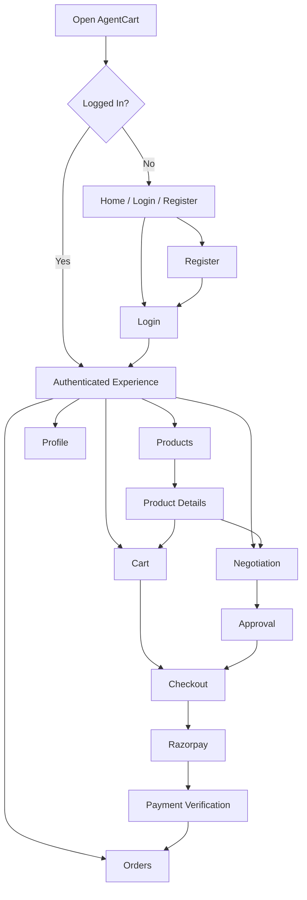

---

# 📊 Future AI Transaction Example

A future AgentCart interaction could look like:

```text
USER

"Find me a laptop for Java development
under ₹70,000."


AI AGENT

Found 5 matching products.

Best match:

Developer Laptop
₹68,500

Reason:
✓ Within budget
✓ Suitable for development
✓ Available
✓ Negotiable


AGENT

"I can negotiate with the seller.
Maximum allowed discount: 10%."


SELLER

Offer: ₹64,999


AGENT

"Final price is ₹64,999.

This is within your ₹70,000 budget.

Would you like me to request purchase approval?"


USER

Approve


SYSTEM

Order Created


RAZORPAY

Payment


SYSTEM

Payment Verified


AUDIT

Transaction recorded
```

This represents the intended direction of **bounded and explainable agentic commerce**.

---

# 🌟 Why AgentCart Is Different

AgentCart is not designed as only another CRUD-based e-commerce application.

The project combines:

```text
Traditional Commerce
        +
Secure Backend
        +
Negotiation
        +
Payment Infrastructure
        +
AI Agents
        +
Policy-Based Automation
        +
Explainability
        +
Auditability
```

The goal is to explore how commerce can evolve when AI agents become active participants in purchasing.

---

# 📈 Engineering Focus

This project demonstrates practical experience with:

### Backend Engineering

- REST API development
- Spring Boot
- Spring Security
- JWT
- JPA/Hibernate
- MySQL
- Layered architecture
- DTOs
- Service-oriented design

### Security

- Authentication
- Authorization
- Password hashing
- JWT validation
- Role-based access control
- Protected APIs

### Payment Engineering

- Razorpay integration
- Order creation
- Payment state management
- Signature verification
- Duplicate-payment prevention
- Approval-gated transactions

### AI / Agentic Systems

- AI agent architecture
- Natural-language commerce
- Machine-readable catalogs
- Policy-controlled actions
- Explainable decisions
- Agentic workflows
- AI recommendations
- Merchant growth automation

---

# 🔮 Advanced Future Architecture

The long-term AgentCart architecture can evolve into:

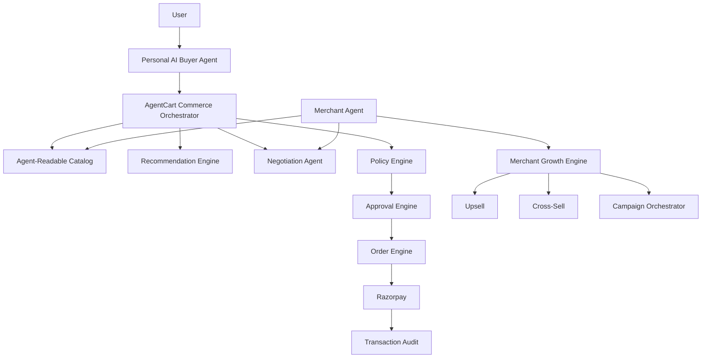

---

# 🎯 Final Goal

The ultimate objective of AgentCart is:

> **To make merchants discoverable, negotiable and transactable by AI buyers while ensuring that every important financial action is explainable, bounded, gated and auditable.**

---

# 👩‍💻 Developer

## Soniya Meena

**B.Tech — Computer Science & Engineering**

### Technical Interests

- Java
- Spring Boot
- Backend Engineering
- REST APIs
- Spring Security
- AI / Generative AI
- Agentic AI
- Payment Systems
- Database Systems
- System Design

### GitHub

**GitHub:**  
https://github.com/soniya1610

---

# 🤝 Contributing

Contributions, suggestions and ideas are welcome.

For major changes:

1. Fork the repository
2. Create a feature branch
3. Implement your changes
4. Test thoroughly
5. Create a pull request

---

# 📄 License

This project is licensed under the MIT License.

---

# ⭐ Support

If you find this project interesting, consider giving the repository a ⭐ on GitHub.

---

## 🚀 AgentCart

### Discover. Negotiate. Buy Smarter.

**Building the future of AI-native commerce.**
